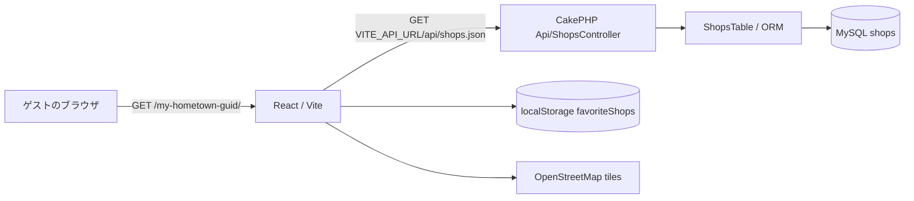
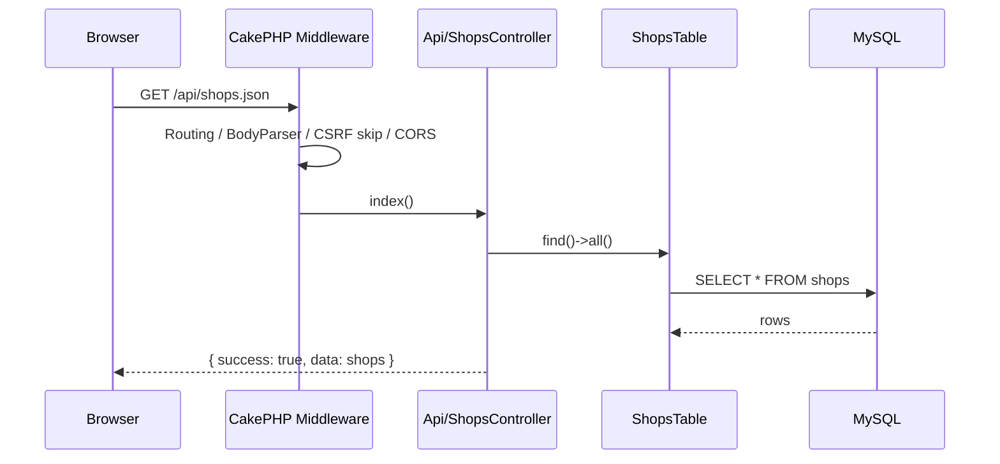

# Architecture

このドキュメントは、My Hometown Guide を AI や新しい開発者が安全に保守するための設計メモです。

## 全体像



- フロントエンドは初回表示時に店舗一覧を API から取得し、以降の地域・ジャンル・お気に入り絞り込みはクライアント側で行います。
- バックエンドは `/api/shops.json` で `shops` テーブル全件を JSON として返します。
- お気に入りはサーバーに保存せず、ブラウザごとの `localStorage` に保存します。
- 地図タイルは OpenStreetMap を利用します。

## Frontend architecture

### Entry points

| ファイル | 役割 |
| --- | --- |
| `frontend/src/main.jsx` | React root のマウント。 |
| `frontend/src/App.jsx` | API 取得、表示状態、フィルター、店舗カード表示。 |
| `frontend/src/MapView.jsx` | Leaflet map lifecycle、marker/popup、カードへのスクロール連携。 |
| `frontend/src/hooks/useFavoriteShops.js` | `localStorage` と React state を同期するお気に入り hook。 |

### State ownership

`App.jsx` が画面状態の中心です。

| state | 用途 |
| --- | --- |
| `shops` | API から取得した店舗一覧。 |
| `selectedShop` | カードクリック時に地図を該当店舗へ移動するための選択状態。 |
| `selectedArea` | 表示対象地域。初期値は `morioka`。 |
| `selectedGenre` | 表示対象ジャンル。地域変更時に `all` へ戻す。 |
| `showOnlyFavorites` | お気に入り店舗のみ表示するか。 |

`useFavoriteShops()` は `favorites`, `toggleFavorite`, `isFavorite` を返し、`favoriteShops` というキーで `localStorage` に保存します。

### Map behavior

`MapView.jsx` は Leaflet の mutable object を React state ではなく `useRef` で保持します。

- `mapRef`: Leaflet map instance。
- `mapContainerRef`: map を描画する DOM element。
- `markersRef`: 店舗 ID ごとの marker instance。

注意点:

- `shops` が変わるたびに既存 marker を削除して再生成します。
- 地域変更時は `areaCenters` の座標へ `setView()` します。
- 店舗カードクリックで `selectedShop` が変わると、該当 marker の popup を開きます。
- popup HTML に店舗名・コメントを入れるため、将来的にユーザー入力データを扱う場合は XSS 対策を再確認してください。

### Build/deploy assumptions

- Vite の `base` は `/my-hometown-guid/` です。
- Leaflet marker assets も同じ公開パスを前提にしています。
- API の origin は `VITE_API_URL` で切り替えます。

## Backend architecture

### Request flow



### API layer

`backend/src/Controller/Api/ShopsController.php` は `JsonView` を利用する設定を持ちつつ、`index()` では明示的に JSON response body を組み立てています。現状は read-only な一覧 API です。

将来的に登録・更新 API を追加する場合は、次を合わせて設計してください。

- CORS の許可 origin / method。
- CSRF skip 対象を API 全体にするか、read-only 以外は別制御にするか。
- バリデーションエラーの JSON 形式。
- 認証・認可の有無。

### Middleware

`backend/src/Application.php` で次の順に middleware を積んでいます。

1. Error handler
2. Asset middleware
3. Routing middleware
4. Body parser
5. CSRF protection（`/api/` は skip）
6. CORS middleware

`backend/src/Middleware/CorsMiddleware.php` は `Access-Control-Allow-Origin: *` を返します。公開後の安全性を高める場合は、環境変数や設定値から許可 origin を限定する方針に変更してください。

## Data model

### `shops` table

| カラム | 型/制約の概要 | 用途 |
| --- | --- | --- |
| `id` | primary key | 店舗 ID。お気に入り保存にも使用。 |
| `name` | string, required | 店舗名。 |
| `address` | string, required | 住所。 |
| `description` | text, required | カード本文。 |
| `lat` / `lng` | decimal, required | Leaflet marker の座標。 |
| `area` | string, nullable | `morioka` / `kitakami` / `hanamaki` を想定。 |
| `comment` | text, nullable | map popup などの短いコメント。 |
| `official_url` | string, nullable | 公式サイトリンク。 |
| `genre` | string, nullable | ジャンルフィルター。 |
| `price_range` | string, nullable | 価格帯表示。 |
| `walk_minutes_from_station` | integer, nullable | 駅からの徒歩分数。 |
| `image_url` | text, nullable | カード画像 URL。 |
| `chosen_by` | enum/string, nullable | `groom` / `bride` / `both`。 |
| `google_map_url` | text, nullable | Google Maps への外部リンク。 |
| `open_time` / `end_time` | string, nullable | `HH:MM` 形式を想定した営業時間。 |
| `created` / `modified` | datetime | CakePHP Timestamp behavior。 |

### Field change checklist

店舗フィールドを追加・変更するときは、最低限次を同じ PR で確認します。

1. `backend/config/Migrations/` に migration を追加する。
2. `backend/src/Model/Entity/Shop.php` の property と `$_accessible` を更新する。
3. `backend/src/Model/Table/ShopsTable.php` の validation を更新する。
4. `backend/tests/Fixture/ShopsFixture.php` と関連テストを更新する。
5. `frontend/src/App.jsx` または `MapView.jsx` の表示・絞り込み・リンクを更新する。
6. README / architecture / skill の説明に影響があれば更新する。

## Operational concerns

### Performance

現状は店舗数が少ない前提で全件取得・クライアントフィルターです。数百件を超える場合は、API に `area`, `genre`, `favorite ids` などのクエリを追加し、DB 側で絞り込む設計を検討してください。

### Security

- CORS は `*` のため、API を公開する場合は必要な origin に限定することを推奨します。
- API は read-only ですが、今後 write API を追加する場合は認証・CSRF・rate limit を検討してください。
- `MapView.jsx` の popup は HTML を組み立てています。管理者以外が入力するデータを表示する場合はエスケープ方針を見直してください。

### Reliability

- `VITE_API_URL` が未設定だと API URL が `undefined/api/shops.json` になります。環境ごとに `.env` / CI / hosting secret を確認してください。
- 公開パスを変える場合は Vite `base` と Leaflet marker asset path を同時に変更してください。
- `localStorage` が利用できない環境でも hook 初期化時は fallback しますが、保存時の例外は現状捕捉していません。

## Recommended validation before release

```bash
cd frontend && npm run lint && npm run build
cd backend && composer test && composer cs-check
```

DB migration や API 変更を含む場合は、ローカルまたは検証環境で次も確認します。

```bash
docker compose up --build
docker compose exec app bin/cake migrations migrate
curl http://localhost:8000/api/shops.json
```
